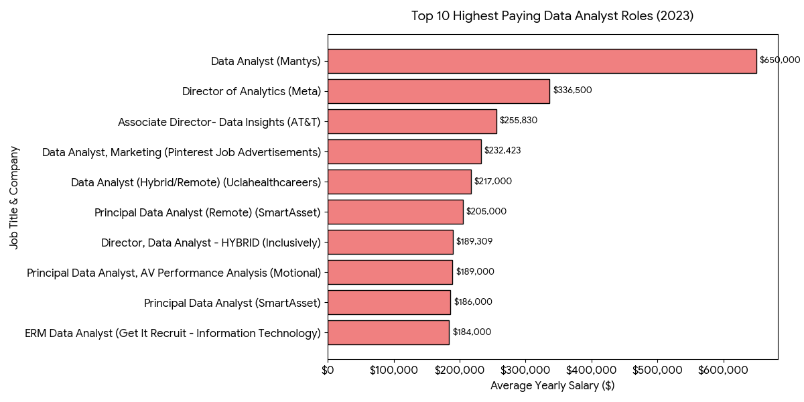
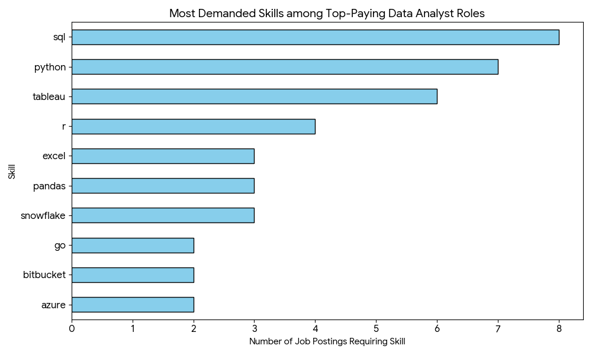
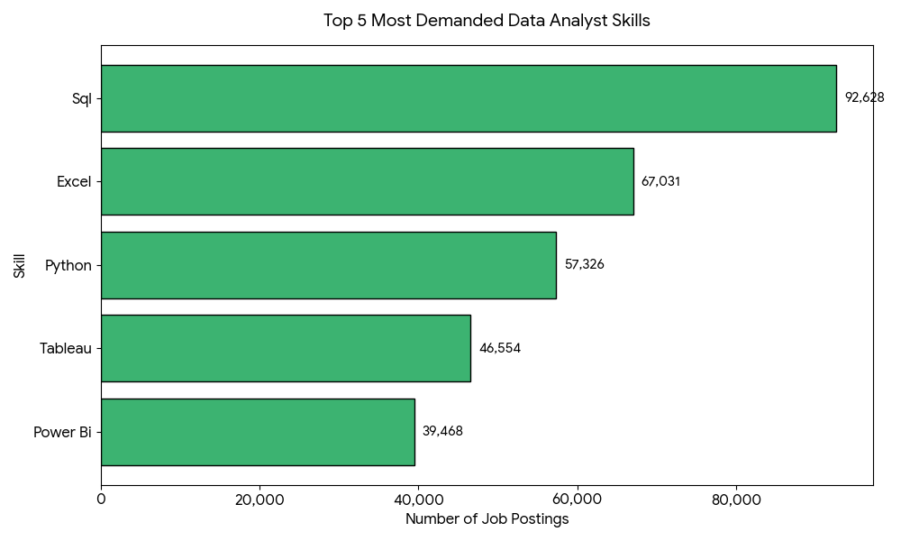
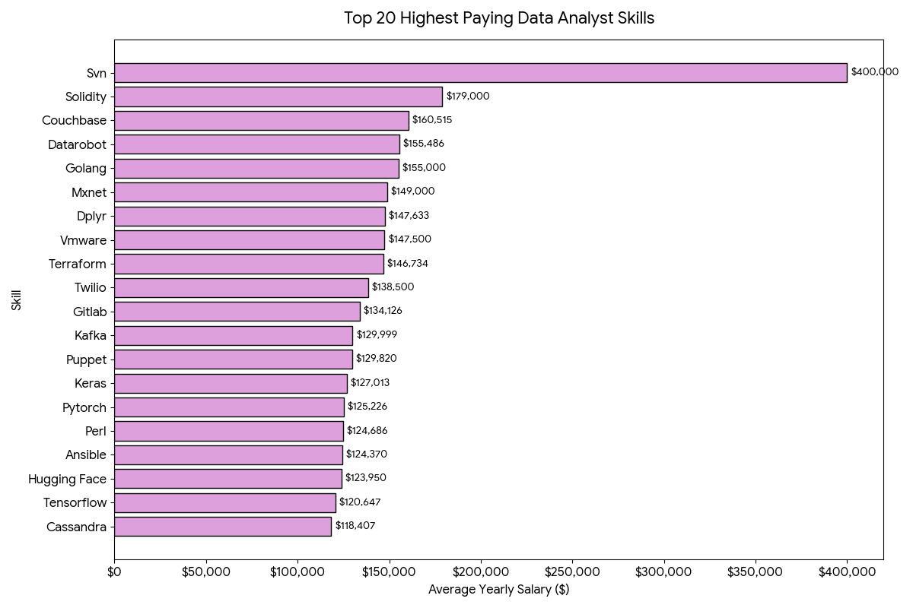
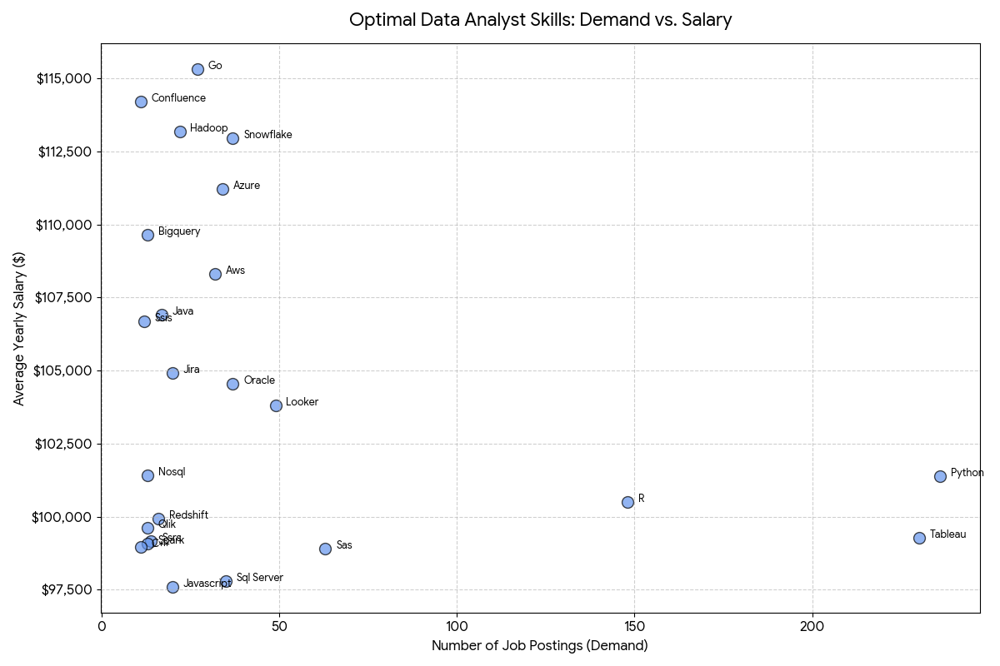

# Introduction
Dive into the data job market. Focusing on data analyst roles, top-paying jobs,
in-demand skills, and where high demand meets high salary in Data Analytics.

SQL Queries. Check out the queries in the [project_sql folder](/project_sql/)

### Questions I wanted to answer through the queries:
1. What are the top-paying data analyst jobs?
2. What skills are required for these top-paying jobs?
3. What skills are most in demand for data analysts?
4. Which skills are associated with higher salaries?
5. What are the most optimal skills to learn?

# Tools I Used
- **SQL:** Main language used to query and analyze the data
- **PostgreSQL:** Database system where all queries were executed
- **Git & GitHub:** Version control and project publishing
- **Trae IDE:** Editor used to write and test queries
- **Claude:** AI assistant used to validate logic and troubleshoot during development
- **Gemini:** AI assistant used to generate visualizations and insights

# The Analysis
Each query for this project aimed at investigating specifiic aspects of the data analyst job market.

### 1. Top Paying Data Analyst Jobs
To identify the highest-paying roles, I filtered data analyst positions by average yearly salary and locatiion, focusing on remote jobs.

``` sql
SELECT jpf.job_title_short, jpf.job_title, cd.name AS company_name,
jpf.salary_year_avg
FROM job_postings_fact jpf
LEFT JOIN company_dim cd ON jpf.company_id = cd.company_id
WHERE jpf.salary_year_avg IS NOT NULL AND
jpf.job_title_short = 'Data Analyst' AND
jpf.job_location = 'Anywhere'
ORDER BY jpf.salary_year_avg DESC
LIMIT 10;
```
Here's the breakdown of the top data analyst jobs in 2023:
- **Wide Salary Range:** The top 10 paying data analyst roles span from $184,000 to $650,000, indicating a significant salary gap.
- **Diverse Companies:** Companies like SmartAsset, Meta, and AT&T are among the top 10 paying data analyst roles, highlighting the demand for data analysts in these sectors.
- **Job Title Variiety:** There's a high diversity in job titles, from Data Analyst to Director of Analytics, reflecting varied roles and specializations within the field.



### 2. Skills for Top Paying Jobs
To understand what skills are required for the top-paying jobs, I joined the job postings with the skills data, providing insights into what employers value for high-compensation roles.

``` sql
WITH top_paying_jobs AS (
SELECT jpf.job_id, jpf.job_title_short, jpf.job_title, cd.name AS company_name ,jpf.salary_year_avg
FROM job_postings_fact jpf
LEFT JOIN company_dim cd ON jpf.company_id = cd.company_id
WHERE jpf.salary_year_avg IS NOT NULL AND
jpf.job_title_short = 'Data Analyst' AND
jpf.job_location = 'Anywhere'
ORDER BY jpf.salary_year_avg DESC
LIMIT 10
)


SELECT tpj.*, sd.skills
FROM top_paying_jobs tpj
INNER JOIN skills_job_dim sjd ON tpj.job_id = sjd.job_id
INNER JOIN skills_dim sd ON sjd.skill_id = sd.skill_id
ORDER BY tpj.salary_year_avg DESC;
```
Here's the breakdown of the skills required for the top 10 highest paying Data Analyst jobs in 2023:

- **SQL** is leading with a bold count of 8
- **Python** follows closely with a bold count of 7.
- **Tableau** is also high sought after, with a bold count of 6.
- **Other** skills like R, Snowflake, Pandas, and Excel show varying degrees of demand.



### 3. In-Demand Skills for Data Analysts
To identify the skills most in demand for data analysts, I analyzed the job postings and skills data.

``` sql
SELECT skd.skills, COUNT(*) AS total_jobs
FROM job_postings_fact jpf
INNER JOIN skills_job_dim sjd ON jpf.job_id = sjd.job_id
INNER JOIN skills_dim skd ON sjd.skill_id = skd.skill_id
WHERE jpf.job_title_short = 'Data Analyst'
GROUP BY skd.skill_id, skd.skills
ORDER BY total_jobs DESC
LIMIT 5;
```
Here's the breakdown of the most demand skills for data analysts in 2023:

- **SQL** Leads the pack by a significant margin, appearing in 92,628 job postings. It remains the undisputed core competency required for extracting and managing data from databases.
- **Excel** Remains incredibly relevant, ranking second with 67,031 postings. This highlights that traditional spreadsheet manipulation is still a daily necessity in the majority of analytics roles.
- **Python** Python ranks third with 57,326 postings. This emphasizes the growing need for analysts to use programmatic logic for data cleaning, advanced statistical analysis, and automation.
- **Visualization Tools** Tableau (46,554 postings) and Power BI (39,468 postings). Combined, these demonstrate that translating data into digestible dashboards and reports is a critical phase of the analytics lifecycle.



### 4. Skills Based on salary
Exploring the average salaries associated with different skills revealed wich skills are the hiighest paying.

``` sql
SELECT skd.skills, ROUND(AVG(jpf.salary_year_avg),0) AS avg_salary
FROM job_postings_fact jpf
INNER JOIN skills_job_dim sjd ON jpf.job_id = sjd.job_id
INNER JOIN skills_dim skd ON sjd.skill_id = skd.skill_id
WHERE jpf.job_title_short = 'Data Analyst' AND
jpf.salary_year_avg IS NOT NULL
GROUP BY skd.skill_id, skd.skills
ORDER BY avg_salary DESC
LIMIT 20;
```
Here's the breakdown of the top highest paying skills for data analysts in 2023:

- **SVN** Associated with an incredible average salary of $400,000. This is a massive outlier. SVN is an older version control system.
- **Solidity** the programming language for writing smart contracts on blockchain platforms like Ethereum, ranks second at $179,000.
- **Machine Learning & AI Dominance** These tools are typically associated with Data Scientists or Machine Learning Engineers, suggesting that Data Analysts who possess these advanced skills can command top-tier compensation.



### 5. Most optimal skills to learn
Combining insights from demand and salary data, this query aimed to point out the skills that are both in demand and high-paying.

``` sql
SELECT skd.skill_id, skd.skills,
COUNT(jpf.job_id) AS total_jobs,
ROUND(AVG(jpf.salary_year_avg),0) AS avg_salary
FROM job_postings_fact jpf
INNER JOIN skills_job_dim sjd ON jpf.job_id = sjd.job_id
INNER JOIN skills_dim skd ON sjd.skill_id = skd.skill_id
WHERE jpf.job_title_short = 'Data Analyst' AND
jpf.salary_year_avg IS NOT NULL AND
jpf.job_work_from_home = TRUE
GROUP BY skd.skill_id, skd.skills
HAVING COUNT(sjd.job_id) > 10
ORDER BY avg_salary DESC, total_jobs DESC
LIMIT 25;
```
Here's a breakdown of the most optimal skills for Data Analysts in 2023:

- **Cloud Skills** Are centered around modern cloud data warehousing and infrastructure. Snowflake ($112,948), Azure ($111,225), and AWS ($108,317) sit perfectly in this "golden middle" zone, offering excellent pay with steady demand.
- **High Pay, Niche Demand** Go (Golang) tops the list at an average of $115,320, closely followed by project management tools like Confluence ($114,210) and big data frameworks like Hadoop ($113,193).
- **Business Intelligence and Visualization Tools** Tableau and Looker, with demand counts of 230 and 49 respectively, and average salaries around $99,288 and $103,795, highlight the critical role of data visualization and business intelligence in deriving insights from data.


# Conclusions
The analysis goes beyond just listing technologies, it provides a data-driven roadmap for navigating the current data analytics landscape. By analyzing the intersection of market demand and compensatioin, several clear directives emerge:

- **The Non-Negotiable Core** Traditional tools are not obsolete, they are the baseline. Mastery of SQL and Excel remains the absolute foundation, representing the highest volume of market demand.
- **Telling a Story** It is very important to turn raw data into a visuals that anyone can understand. Knowing how to use Tableau or Power BI is not just a bonus, it is required.
- **Best Path Forward** To build a great career, the data shows a clear path. Start with  a strong base in Python, and then learn a bit about cloud tools like AWS or Snowflake.

Data is only as valuable as the decisions it drives. This project highlights that the most succesful analyst are those who bridge the gap between technical skiills and business strategy. Pairing robust database querying with advanced visualization to solve real-world problems.
